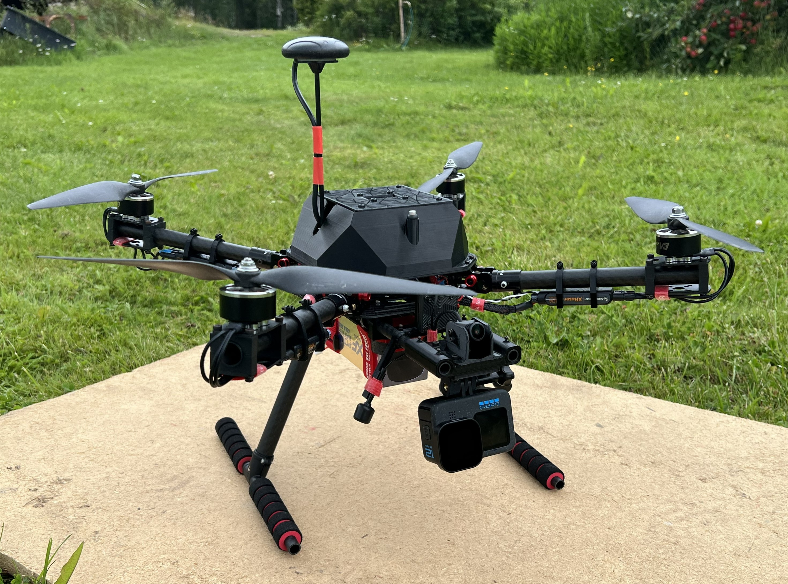
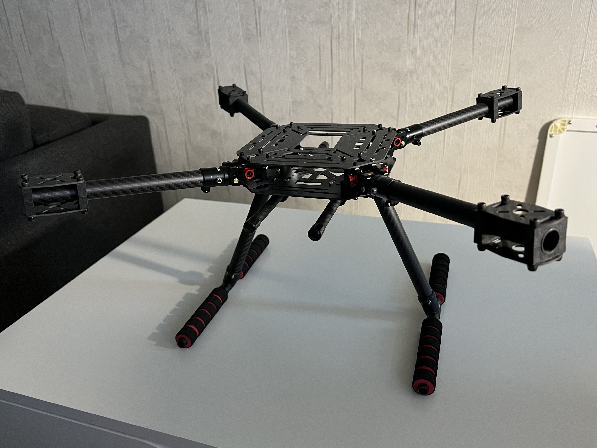
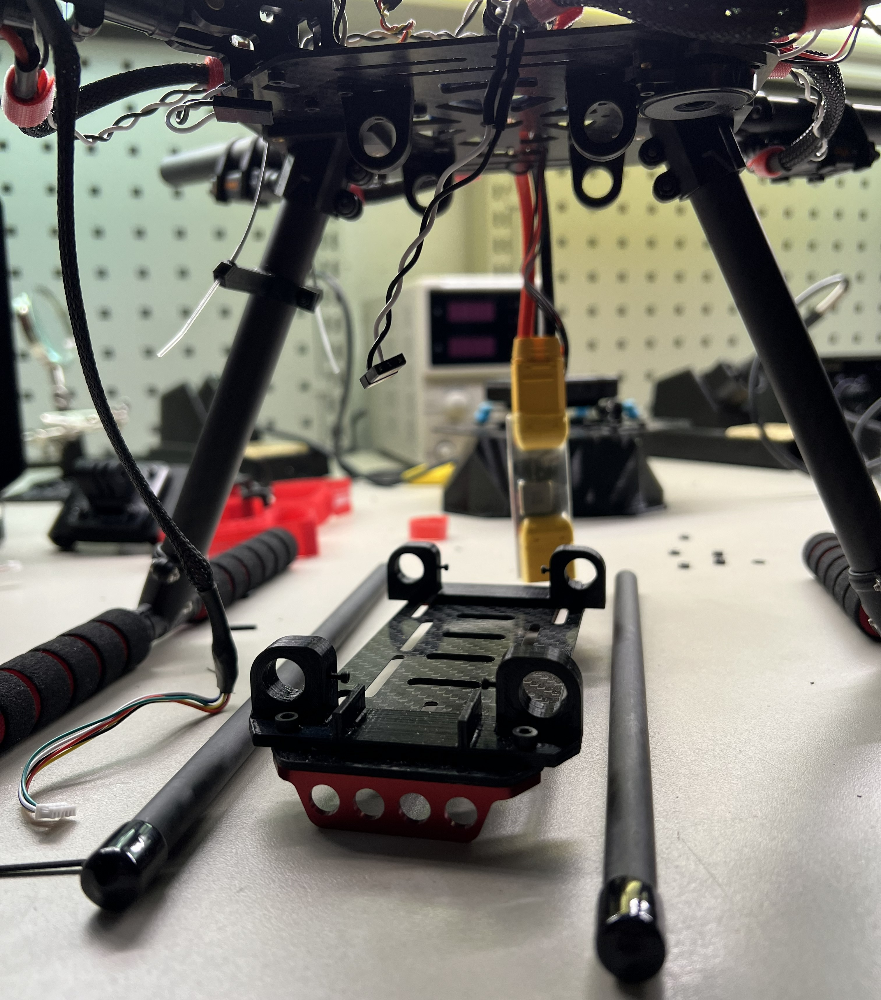
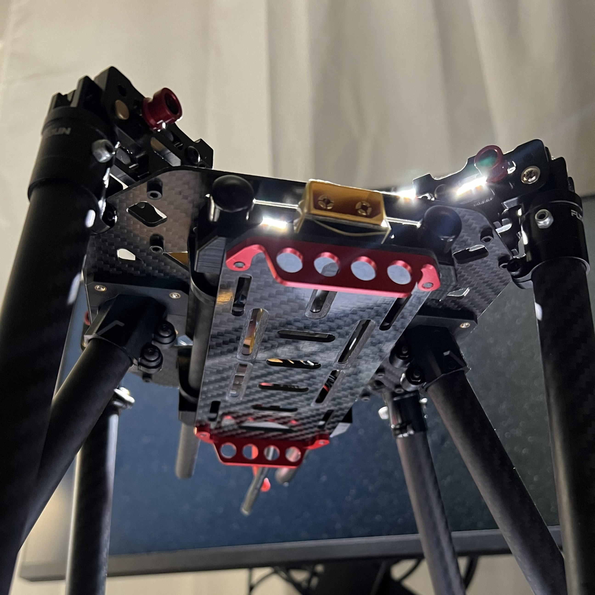
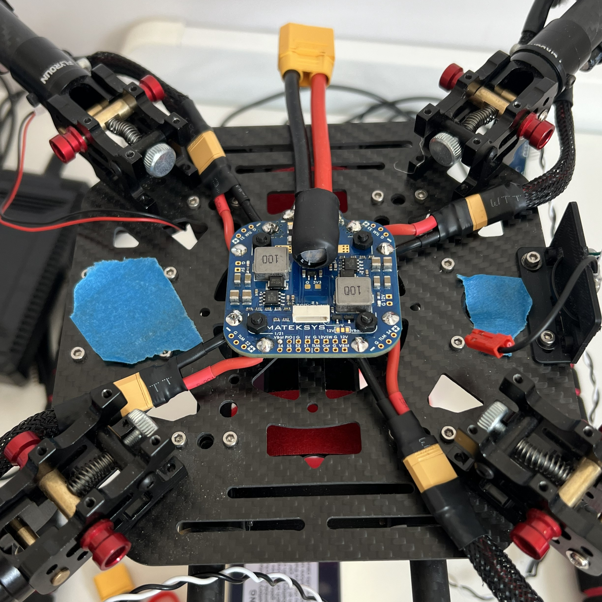
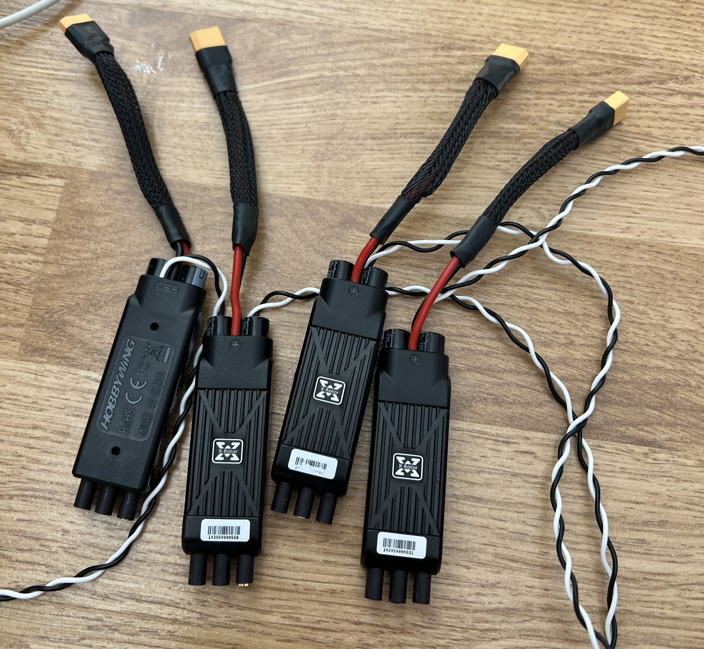
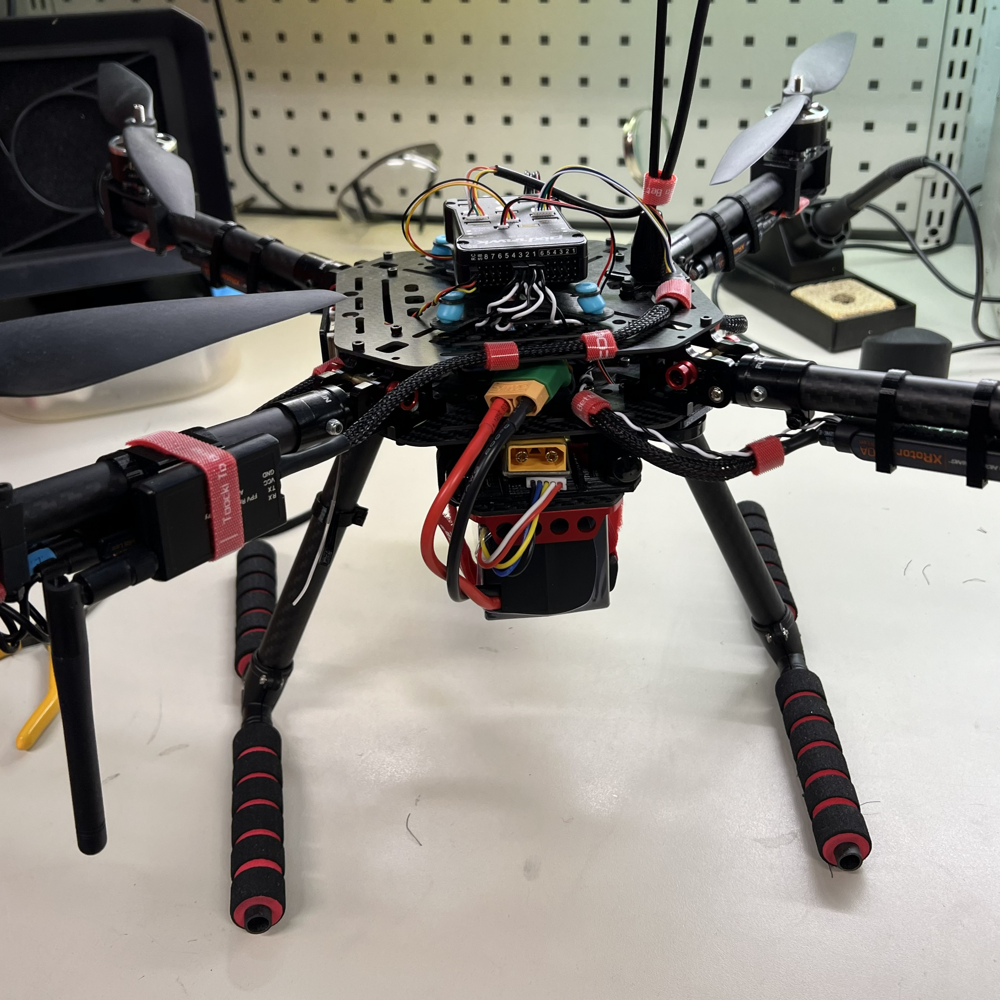

## The Industrial Drone

  
  
<em> </em>

I’ve always wanted to build my own drone, so in 2023 I finally decided to make it happen. A drone is the perfect project for me because it combines almost all of my interests: power electronics, digital electroncis, RF stuff, mechanics, embedded software etc. I chose to build a larger 'industrial-style' platform to serve as a platform for my own future custom attachments and experiments.

While the project utilized commercial components, the system integration was a challenge. Work began in late 2023 when a mountain of parts arrived without instructions. To turn them into a functional aircraft, I designed and 3D printed custom mounts for nearly every subsystem—including cameras, batteries, antennas, and power distribution electronics.

**Key learnings:**
  
  - ArduPilot flight controller software.
  - Drone systems: Basic components, battery technologies, wireless communication, protocols, control electronics
  - Practical electronics skills.
  - Strong knowledge and practical experience on 3D printing (PLA, PETG) and 3D modelling (SolidWorks, onshape).

**Future of the project:** 
  
  - Design of my own power distribution board that measures current, filters the power and regualtes it for the electronics.
  - I am planning on desigining my own gimbal / camera orientation control system for the drone. 

## Project Details

The project began with system simulation using eCalc to define the optimal powertrain. The motor, propeller, and ESC combination was selected to maximize payload capacity while ensuring high efficiency for extended flight times. Simulations indicated that an 11x4.5 propeller configuration offered the best performance. A 4S battery architecture was chosen to minimize overall system weight and cost without compromising the required energy capacity. The final design achieves a theoretical thrust-to-weight ratio of 3:1 and a hover flight time of approximately 24 minutes, providing a lifting capacity of 3–4 kg with ample margin for future accessories.

  
  
<em> Simulation results for the components. </em>

**Specs:**
  
  - Weight: ~2.2 - 2.5 kg (With 9200 mAh 4S LiPo battery)
  - Motor Power: 4x 800W -> ~3-4 kW peak power
  - Estimated Max Thrust: ~ 4 kg
  - Flight Time: 10 minutes rough flight, Smooth flight +20 minutes
  - Max Current:  +120 A (measured, from 4S battery)

**Components:**
  
  - Motors: BrotherHobby Avenger V3 2812-900KV
  - ESC: Hobbywing XRotor Pro 40A (60A Peak)
  - Power Distribution Board: Mateksys XCLASS PDB FCHUB-12S
  - Propellers: Biblade 11 x 4.5, carbon reinforced / 10x5 Triblade
  - Flight Controller: Pixhawk 2.4.8
  - Controller communication: Radiomaster RP3 ELRS transceiver with two antennas
  - Frame: F450 Carbon Fiber with retracting arms
  - VTX: Walksnail Avatar HD Pro kit V2

As said before, I had to design practically all the mounts to every separate component of the drone. The frame is a generic carbon fiber frame which had no mounts for the battery or gopro or almost anything. The project began on an empty frame and 1000 separate bags of parts and accessories.

  
  
<em> </em>

### Battery Mount and Power Distribution
Since this drone is quite large and uses large batteries (~10 000 mAh / 4s) I used a separate RC car battery holder that was meant for heavy batteries. It was installed upside down on the drone with custom 3D printed mounts. The drone has a current sensor which I designed to lay in between the battery mount and the frame. This saved space and led to a convenient position for the battery XT-connectors.

  
  
<em> </em>

  
  
<em> </em>

The current sensor led to the Power Distribution Unit (PDU) that split the battery to the ESCs and regulates it for the flight controller and other perihperals. Mateksys XCLASS PDB FCHUB-12S was selected for its high current rating and peripheral controllability. With this PDB it was possible to control the easily overheating video transmitter (VTX) on or off with the remote controller while on the ground.

  
  
<em> </em>

### Wiring and Cable Management

The entire project and all wiring were done as well as I could. I did all the soldering as well as I could, and almost every wire was neatly sheathed and pulled. The drone was also designed to be as modular and maintenance-free as possible. High-quality XT connectors or bullet connectors were used throughout so that everything can be disassembled for improvements or repairs if necessary.

  
  
<em> </em>

  
  
<em> </em>

### Accessory Mounts

I designed a custom accessory mount and camera mount for GoPro. This generic accessory mount can be attached to virtually any custom mount for cameras or lights or anything. The accessory mount has 45x45mm mountingholes that can be screwed into anything. On top is an FPV camera mount with an adjustable angle. A separate mount was designed for the FPV camera's video transmitter to keep it in a cooling air stream. The dual antennas are positioned at an angle of approximately 50 degrees in a V-formation facing downwards to maximize the range of the video link.

  
  
<em> </em>

  
  
<em> </em>

The drone uses the ELRS protocol with the controller. I chose the Radiomaster RP3 ELRS transceiver with two antennas. A custom mount was also designed and 3D printed for this.

  
  
<em> </em>

### Covers and other parts

I also designed a cover for the flight controller and its cables and improve the aerodynamics of the drone. The 3D printer calibration was successful, and this is one of the best PETG prints I have ever made. Later, I redesigned the entire cover and added a lid with an OLED display showing the drone's status.

  
  
<em> </em>

  
  
<em> </em>

  
  
<em> </em>

### Finished Build

The drone is practically ready and airworthy. The drone flies nicely and works as expected. Overall the project was a success and a huge learning process for me. The project will likely continue according to the plans mentioned above.

