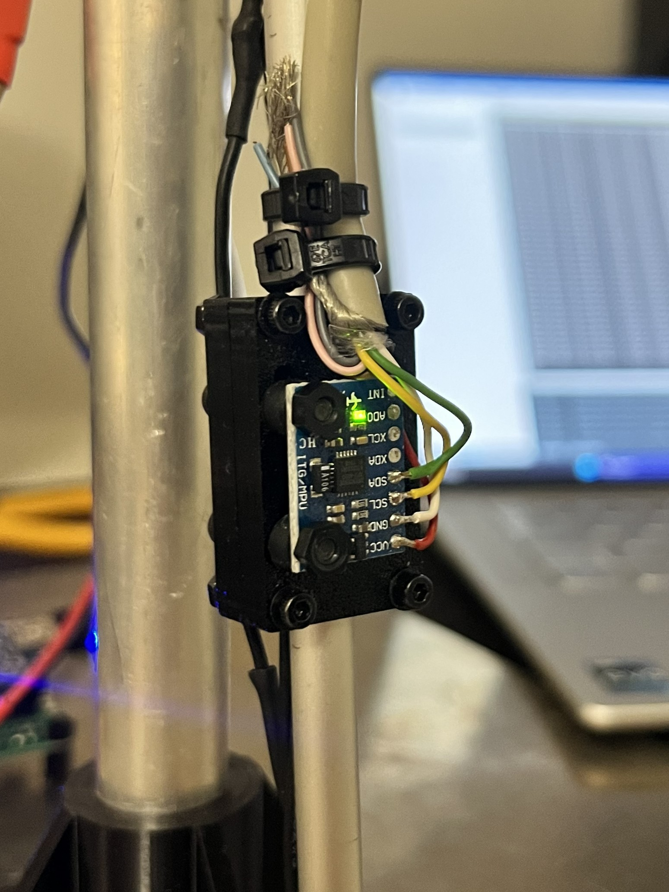

## The Monorotor Project

### Key lessons learned from the project
- Complementary filtering
- Inertial dataprocessing
- PID controller implementation
- PID tuning
- Mechanical design, 3D pringing, 3D modeling

### Project description

<!--  -->

<div align="center">
  
  <p><em> Hovering monorotor system.</em></p>
</div>


How does the device work and what does it do?

The device has a hinge and a lever arm with a drone motor at the end. The lever arm is lifted by the drone motor and adjusted to the angle set by the user with a potentiometer. The aim of the project was to try to implement a PID controller in practice. 

I designed the 3D model, printed it, and built the test setup myself from scratch. The hinge parts and mounts for the motor, motor controller, and sensor are 3D printed from PETG plastic.

The electronics consist of a generic BLDC motor, motor controller, MPU6050 inertial measurement unit, and microcontroller (Arduino Nano as a fast prototype). The hardware uses the IMU to measure the acceleration and angular velocity of the lever arm, which are used to calculate the angle of the lever arm with a complementary filter. This angle is adjusted with a PID controller. The angles and PID parameter values can be observed via a serial terminal on a computer.

I implemented the complementary filter algorithm line by line using Matlab software because I wanted to understand how IMU data is calculated. The algorithm was easy to convert to C code. The use of the algorithm is practically mandatory because the acceleration sensor and gyroscope do not work well on their own. The algorithm combines the strengths of the sensors and cancels out their weaknesses to achieve a better angle estimate.

<!--  -->

<div align="center">
  
  <p><em> The IMU sensor is attached with rubber mounting to isolate vibrations.</em></p>
</div>

I also calculated the PID controller manually from scratch and used the Tustin method for discretization. The PI controller was adjusted iteratively. The gain was increased until the system became unstable, and then the value was decreased slightly. The Ki gain was then increased until the system became unstable again, and it was lowered slightly. After this, the values were fine-tuned by analyzing the system's operation to achieve the best result.

### Results

The motor introduced massive vibrations that distorted the coplementary filter angle estimation. A digital low-pass filter was activated on the MPU6050 as well as a moving average was implemented on the microcontroller side. The MPU6050 was also fastened with a rubber mount to the shaft to reduce the vibrations and improve the complementary filter performance.

There were a lot of mechanical issues. The bearing had unpredictable friction and considerable sideways wobble that introduced oscillations to the system. The motor also produces nonlinear force towards the gravity component depending on the shaft angle which made the tuning quite difficult with a basic iterative method. 

A marginally stable open loop step response was found manually. A throttle walue of 1420 (range: 1000-2000) led to a barely stable behaviour. System was extremely unstable and any further increse in the throttle would lead the system to flip completely upwards. The open loop system had a rise time of around 2-3 seconds with considerable overshoot. 

<!--  --> 

<div align="center">
  
  <p><em>Open loop step-response.</em></p>
</div>


The system encountered a conflict between power and stability: lifting the arm required high gains, but these caused strong oscillations in the upper position. To correct this problem, I implemented multi-stage control logic. The controller uses aggressive gains Kp, Ki to raise the arm from rest, but automatically switches to conservative values near the target angle to maintain stable hovering without overshoot. The logic is visualized in the block diagram below.

<!--  --> 

<div align="center">
  
  <p><em> Control logic block diagram.</em></p>
</div>

The final performance of the controller was limited by mechanical issues and the iterative tuning method. Due to unpredictable friction and structural instability, the tuning method was changed to be **overdamped response** in order to prioritize stability over fast response. This prevented overshoot but resulted in a slow settling time of approximately 20 seconds and a steady-state error of 3–5 degrees. The tune could most likely be improved by iterating the gain values further. Future iterations would benefit from a physics-based mathematical model and improved mechanical design using bearings to reduce nonlinearities. Closed-loop system response is shown below.

<!--   --> 

<div align="center">
  
  <p><em> PID-tuned closed loop step-response.</em></p>
</div>

### Future of the project

- Improving PID controller tune based on a mathematical model of the system
- Improving system mechanics (adding bearings, redesigning the hinge etc.)

### Codes and other materials

The control software was written in C++. The code handles the IMU data acquisition via I2C, runs the complementary filter, and computes the PID output at a fixed sampling rate of 120Hz using Timer2 interrupts.

Key details regarding code:

- Timer interrupts for fixed 120 Hz looping
- Complementary filter for angle estimation
- Variable PID parameters for countering unlinearity of the system dynamics

<!-- CODE -->

### Source Code:

```cpp linenums="1"
  #include <Wire.h>
  #include <Servo.h>

  // Pins
  const int PIN_MOTOR = 11;
  const int PIN_POT = A2;
  const int MPU_ADDR = 0x68;

  // Controller parameters:
  const int controller_saturation_limit = 1700;
  const int max_ref_angle = 90;

  // PID settings
  volatile float Kp = 1.5;   
  volatile float Ki = 0.1;
  volatile float Kd = 0.3;

  // Complementary filter settings
  const float alpha = 0.96; 

  // Variables:
  volatile float currentAngle = 0;
  volatile float gyroRate_prev = 0;
  volatile float currentGyroRate = 0;
  volatile float targetAngle = 0;
  volatile float pi_err_prev = 0;
  volatile float pi_yi_prev = 0;
  volatile float err = 0;

  const int moving_avg_size = 15;
  int16_t rawAccY, rawAccZ, gyroX;
  int16_t accYBuffer[moving_avg_size];
  int16_t accZBuffer[moving_avg_size];
  int bufferIndex = 0;

  float debug_P = 0;
  float debug_I = 0;
  float debug_D = 0;

  // Servo instance for the ESC. 
  // ESC is controlled with PWM.
  Servo ESC;

  // Bool = 8 bits = atomic operation with AVR processors!
  // No mutex / semaphore needed when this is sampled!
  bool read_data_flag = false;

  #define sampling_rate 120

  const float h = 1/(float)sampling_rate; // step size for integration


  ISR(TIMER2_COMPA_vect){
      read_data_flag = true;
  }


  void setup() {

    // Stop interrupts during initialization!
    // cli();

    // Initialize serial communication to terminal  
    Serial.begin(19200);
    Serial.println("Begin system initialization...\n");
    delay(1000);

    // Init I2C communication with MPU6050
    Wire.begin();
    // MPU6050 Settings. Wake up from sleep and 8 MHz clock.
    Wire.beginTransmission(MPU_ADDR);
    Wire.write(0x6B); 
    Wire.write(0); 
    Wire.endTransmission(true);
    
    // Set the MPU6050 digital low pass filter active for the ACC and Gyro.
    Wire.beginTransmission(MPU_ADDR);
    Wire.write(0x1A); // Set LPF register
    Wire.write(0x05); // Write 42 Hz DLPF active
    Wire.endTransmission(true); 

    // Zero the buffer depenfing on moving average size.
    // For loop allows adjusting the buffer size with a variable.
    for(int i=0; i<moving_avg_size; i++){
      accYBuffer[i] = 0; 
      accZBuffer[i] = 0;
    }

    // Initialize the angles.
    // Sensor is read 50 times to obtain the initial angle of the system.
    Serial.print("Calibrating...");
    long startSumY = 0, startSumZ = 0;
    for(int i=0; i<50; i++) {
      readIMU();
      startSumY += rawAccY;
      startSumZ += rawAccZ;
      delay(5);
    }

    // Set the initial angle according to the "calibrated" value.
    // Only calculated based on acc values!
    float startY = startSumY / 50.0;
    float startZ = startSumZ / 50.0;
    currentAngle = atan2(startY, startZ) * 180.0 / PI;
    
    Serial.print("Initial Angle: "); 
    Serial.println(currentAngle);

    // Motor is controlled with ESC PWM library.
    ESC.attach(PIN_MOTOR);
    // 1000us = 0% throttle
    // 2000us = 100% throttle
    ESC.writeMicroseconds(1000);
    
    Serial.println("System Initiated.");
    delay(1000);

    // Initialize Timer and Interrupt
    // We use TImer2 because servo library uses timer 1.
    // Zero the 
    TCCR2A = 0;
    TCCR2B = 0;
    TCNT2  = 0;
    // Set Timer2 to CTC, clear timer on count. This sets the repeating timer interval.
    TCCR2B |= (1 << WGM21); 
    // Set prescaler to 64
    TCCR2B |= (1 << CS22);  
    // Activate timer2 interrupts.
    TIMSK2 |= (1 << OCIE2A);

    OCR2A = 206; // 16MHZ / prescaler [64] / counter value 206 = 120 Hz 

    sei();

  }

  int incomingByte = 0; // for incoming serial data
  uint8_t boost_P = 0;
  uint8_t reduce_I = 0;

  void loop() {
    
    if (read_data_flag) {

      // Reset the flag!
      read_data_flag = false;
      
      // reads the filtered IMU measurement values.
      readIMU();

      /* Read requested angle set with the potentiometer. */
      int potValue = analogRead(PIN_POT);
      /* Map the value in between 90 and -90 degrees. */
      
      targetAngle = map(potValue, 0, 1023, -max_ref_angle, max_ref_angle); 
      currentAngle = complementaryFilter();

      float pidOutput = 0;

          
      // If the system is in rising stage, angle < -20
      if (currentAngle < -20) {
        
        // Reset reduce I state
        reduce_I = 0;       
        // Increase power
        pidOutput = PIDController(2.0*Kp, 3.0*Ki, 1.25*Kd, targetAngle, currentAngle, h);

      } else { 

        // Check if we are close to level or the Integrator is floating / too high
        if (currentAngle > -5 && pi_yi_prev > 100.0) {
            // Reduce the I linerly
            pi_yi_prev = pi_yi_prev - 0.5; 
        }
        
        // Calculate with normal PID parameters and compensated intergrator.
        pidOutput = PIDController(Kp, Ki, Kd, targetAngle, currentAngle, h);
      }
      
      // pidOutput = PIDController(Kp, Ki, Kd, targetAngle, currentAngle, h);

      int baseThrottle = 1100;
      int motorPWM = baseThrottle + (int)pidOutput;

      int finalPWM = constrain(motorPWM, 1000, controller_saturation_limit);
      ESC.writeMicroseconds(finalPWM);

      static int printCounter = 0;
      if (++printCounter >= 25) { 
        Serial.print("Tgt ang:"); Serial.print(targetAngle, 1);
        Serial.print("Cur ang;"); Serial.print(currentAngle, 1);
        Serial.print(" | P:"); Serial.print(debug_P, 1);
        Serial.print(" | I:"); Serial.print(debug_I, 1);
        Serial.print(" | D: "); Serial.print(debug_D, 1);
        Serial.print(" | Cur throt: "); Serial.print(finalPWM, 1);
        Serial.print("\r\n");
        printCounter = 0;
      }
    }
  }

  void readIMU() {

    // Initiate read from MPU6050 Acc data register 0x3B
    Wire.beginTransmission(MPU_ADDR);
    Wire.write(0x3B);
    Wire.endTransmission(false);
    
    // Start actual read from the data register.
    // Read 6 bits at a time from the 0x3B register.
    // Continue from next register.
    Wire.requestFrom(MPU_ADDR, 6, true);
    
    int8_t acc_x_msb = Wire.read();
    int8_t acc_x_lsb = Wire.read();
    int8_t acc_y_msb = Wire.read();
    int8_t acc_y_lsb = Wire.read();
    int8_t acc_z_msb = Wire.read();
    int8_t acc_z_lsb = Wire.read(); 

    // Shift and cast MSB and LSB into one 16bit signed value.
    int16_t acc_x = (int16_t)(acc_x_msb << 8 | acc_x_lsb);
    int16_t acc_y = (int16_t)(acc_y_msb << 8 | acc_y_lsb);
    int16_t acc_z = (int16_t)(acc_z_msb << 8 | acc_z_lsb);

    // Initiate read from MPU6050 Gyro data register 0x43
    Wire.beginTransmission(MPU_ADDR);
    Wire.write(0x43);
    Wire.endTransmission(false);
    Wire.requestFrom(MPU_ADDR, 6, true);

    // Start actual read from the data register.
    int8_t gyro_x_msb = Wire.read();
    int8_t gyro_x_lsb = Wire.read();
    
    // Shift and cast MSB and LSB into one 16bit signed value.
    gyroX = (int16_t)(gyro_x_msb << 8 | gyro_x_lsb);

    // Moving Average / Ring buffer Filtering:
    accYBuffer[bufferIndex] = acc_y;
    accZBuffer[bufferIndex] = acc_z;
    
    bufferIndex++;
    // If the buffer index is reached, jump to beginning.
    if (bufferIndex >= moving_avg_size){
      bufferIndex = 0;
    }

    long sumY = 0, sumZ = 0;
    for(int i=0; i<moving_avg_size; i++){ 
      sumY += accYBuffer[i];
      sumZ += accZBuffer[i];
    }
    rawAccY = sumY / moving_avg_size;
    rawAccZ = sumZ / moving_avg_size;
  }

  float complementaryFilter() {
    
    // Calculate angle based on Acc:
    float accAngleDeg = atan2(rawAccY, rawAccZ)*(180.0/PI);
    
    // Convert rad/s to deg/s:
    float gyroRateDeg = (float)gyroX/(131.0); 
    
    // Integrate gyro reading to change of angle:
    float deltaAngleGyro = (h/2.0)*(gyroRateDeg + gyroRate_prev);
    
    // Store the revious gyro result for next round integration;
    gyroRate_prev = gyroRateDeg;
    currentGyroRate = gyroRateDeg;
    // Estimate new angle based on Gyro (previous + change of anlge):
    float angleEstimateGyro = currentAngle + deltaAngleGyro;

    // Fuse the two results:
    float fusedAngle = alpha*angleEstimateGyro + (1.0-alpha)*accAngleDeg;
    

    return fusedAngle;
  }

  float PIDController(float Kp, float Ki, float Kd, float ref, float y, float h) {
      
      float yp, yi, yd, out;

      // Integrator saturation value.  
      const float max_i_term = 350.0; 

      err = ref - y;

      yp = Kp * err;

      // Integrate gyro angles with trapezoidal method.
      yi = Ki * (h / 2.0) * (err + pi_err_prev) + pi_yi_prev;

      if(yi > max_i_term){
        yi = max_i_term;
      } else if(yi < -max_i_term){
        yi = -max_i_term;
      }

      // yd = Kd*((err-pi_err_prev)/h);
      // calculate derivative from gyroscope, not the error and potentiometer....
      yd = -Kd * currentGyroRate;

      out = yp + yi + yd;

      debug_P = yp;
      debug_I = yi;
      debug_D = yd;
      
      pi_yi_prev = yi;
      pi_err_prev = err;
      
      return out;
  }
```


