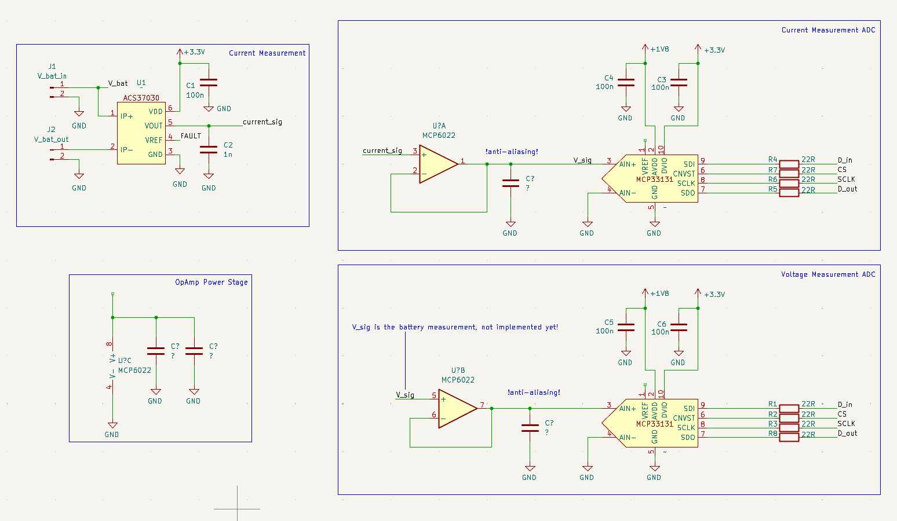

## The Drone Motor Testbench (Work in Progress)

This is a personal project that is a work in progress. The idea for this project arose from the need to optimize motor-propeller combinations for the industrial drone project.

### General description of the device

The aim of the project is to design and implement a test bench suitable for drone motors, capable of measuring the current, voltage and power of the drone motor, the rotational speed of the motor or blades, and the thrust generated by the motor. The idea is that different combinations of motors, propellers, and motor controllers can be tested to achieve the best efficiency.

The device measures the motor's current and voltage which can be used to calculate the power taken from the battery. The device measures the thrust generated by the motor with a load cell that is mechanically coupled to the motor. The propeller rotational speed is also measured with an optical sensor.

### Planned features

- Compatibility for various types of motors and motor controllers.
- Web UI for graphing measurement results in real time
- Battery operable from typical drone batteries (input voltage range up to 30 V) 
- Automated test sequences
  
### Target specifications

Current measurements:

- Max Current: 60 A
- Accuracy:   100 mA
- Resolution: 10 mA.
- Bandwidth: 10 kHz.

Voltage measurements:

- Max input Voltage: 30 V
- Accuracy: 100 mV
- Resolution: 10 mV.
- Bandwidth: 10 kHz.

Thrust measurements:

- Range: 0-5 kg
- Accuracy: 20g
- Resolution: 10g

Propeller measurements:

- Rotational speed: 20 000 rpm
- Accuracy: 100 rpm

### Current Progress / Initial Designs **(Very much Subject to Change)**

The initial plan for the system has been created and is shown in the block diagram below. The exact components may still change. In particular, the ADCs may still be changed. The goal is to implement the different parts of the system step by step and eventually integrate everything onto a single circuit board.

The project is intended to be as modular as possible so that it can be developed in parts. For example, a cost effective and readily available generic load cell + HX711 ADC combination was been chosen for thrust measurement. This will be replaced later with a higher-quality solution later on. 

  
  
<em> System block diagram (WIP).</em>

### Component Selection

The ESP32 was chosen as the microprocessor because it has Wifi capability and can stream the measurement results via a web server UI. 

#### Current Measurement

The Allegro Microsystems ACS37032-065B3 Hall-effect current sensor was selected for the project because it met all the requirements and was reasonably priced. In addition, the package is easy to solder by hand and the sensor appeared to be simple to use.

[Datasheet:](https://www.mouser.com/catalog/specsheets/Allegro_MicroSystems_01032024_ACS37030-32-Datasheet.pdf)

The sensor is capable of measuring current up to 65 amps with a bandwidth of 5 MHz, which is sufficient for one drone motor and meets the project requirements. The sensor produces a voltage proportional to the current passing through with a sensitivity of 20.3 mV/A. At full 65 A current, the sensor produces an output voltage of approximately 1.32 V. Although the internal resistance of the measurement circuit is low (0.6 mΩ), the power loss generated at peak currents is significant (2.5 W) and requires sufficient cooling.

The ACS772LCB-100B-SMT-T might have been a better choice for the current sensor. Its internal resistance is only 100 micro-ohms, so it would have been better able to withstand continuous loading. In addition, its current measurement range is up to 100 A, so it could also have been used with larger motors.

[Datasheet:](https://www.allegromicro.com/~/media/files/datasheets/acs772-datasheet.pdf)

#### ADCs and buffering

The 16-bit Microchip MCP33131 ADCs were chosen for their high sampling rate (up to 1 Msps). Since the MCP33131 uses a Successive Approximation Register (SAR) architecture, it draws a dynamic current during the acquisition phase. To prevent voltage droop and ensure measurement accuracy, an op-amp voltage buffer was implemented in the signal path.

The MCP6022 dual op-amp was selected as the buffer due to its high Gain Bandwidth Product (10 MHz) and cost-effectiveness. Its Rail-to-Rail Input/Output (RRIO) capability is essential for this single-supply, low-voltage system. The signal path design is iterative; future versions will include tuned anti-aliasing filters to further improve signal integrity.

  
  
<em> Sensors and ADCs (WIP). </em>

#### Power regulation

The power architecture is divided into two stages to ensure signal integrity and efficiency.

Analog and Digital Logic: The MCP33131 ADC requires a clean 1.8 V analog supply, while its digital interface supports voltages from 2.5 V to 5 V. A 3.3 V rail was selected for the digital interface to match the ESP32’s SPI logic levels directly. To minimize noise coupling and ensure measurement accuracy, all sensitive analog components (ADC, Op-Amps, and sensors) are powered via dedicated Low Dropout Regulators (LDOs).

Primary Power Stage: The main system power—supplying the ESP32, LDO inputs, and the cooling fan—is handled by a DC-DC buck converter stage. This stage is implemented using the TPS62933 synchronous buck converter. The IC supports a wide input voltage range of 3.8 V to 30 V, which provides significant flexibility: the test bench electronics can be powered directly by almost any standard drone battery pack (ranging from 1S to 6S) independent of the motor power supply.

  
  
<em> Power regulators (WIP).</em>

### PCB design
The PCB design is currently in the preliminary layout phase. The physical dimensions of the board are largely dictated by the ESP32 Development Kit footprint, which was chosen to accelerate the prototyping process.

Handling currents up to 65 A requires special attention in the layout. The design features wide, exposed copper planes (soldermask removed) on both top and bottom layers. This allows for manual solder tinning to increase the effective conductor thickness, thereby reducing resistance and improving thermal management.

Things that will be considered in the build:

- Stackup: Planned 4-layer configuration (SIG/PWR – GND – GND – SIG) to ensure solid return paths and noise suppression.
- Signal Integrity: Series termination on high-speed SPI buses; impedance-controlled routing for critical signals.
- Mixed-Signal Layout: Strict physical separation between digital logic and sensitive analog domains; minimized trace lengths for analog signals.
- High Current Path: Reinforced copper pours exposed for solder tinning to handle up to 65 A in the measurement section.
- Thermal Management: Component placement optimized for airflow and heat dissipation, particularly for the current measurement and regulators.
- Modularity: Design allows for future upgrades or swapping of specific sub-circuits.
- ESD / polarity protection of inputs
- Testpoints and proper silkscreens

  
  
<em> Draft of the PCB design. </em>

