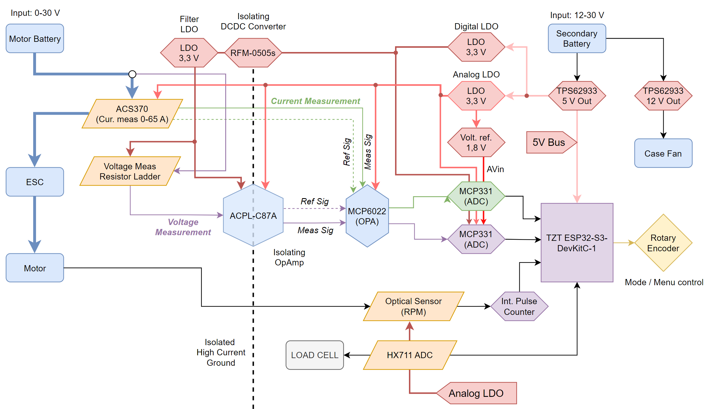
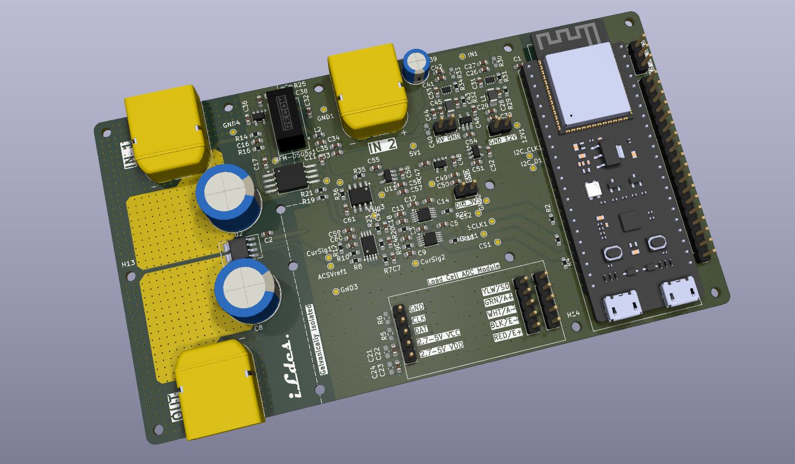
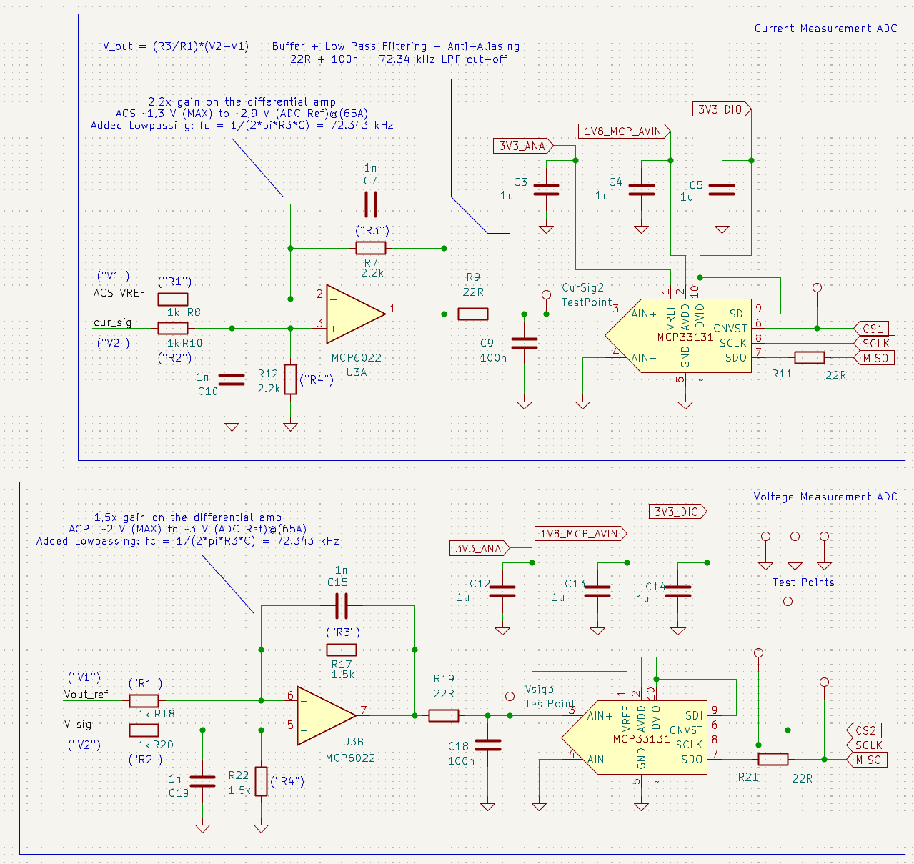
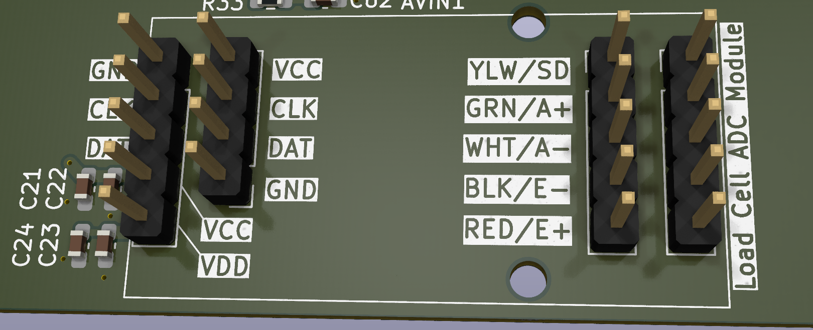
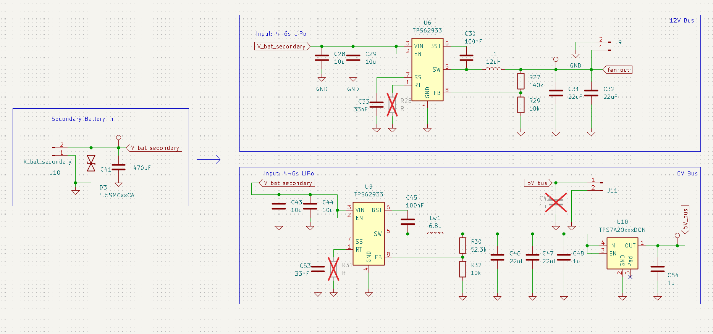
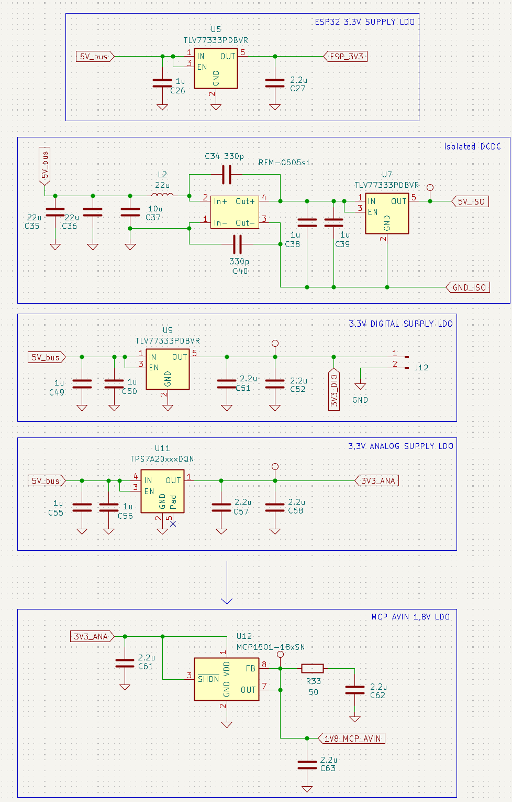
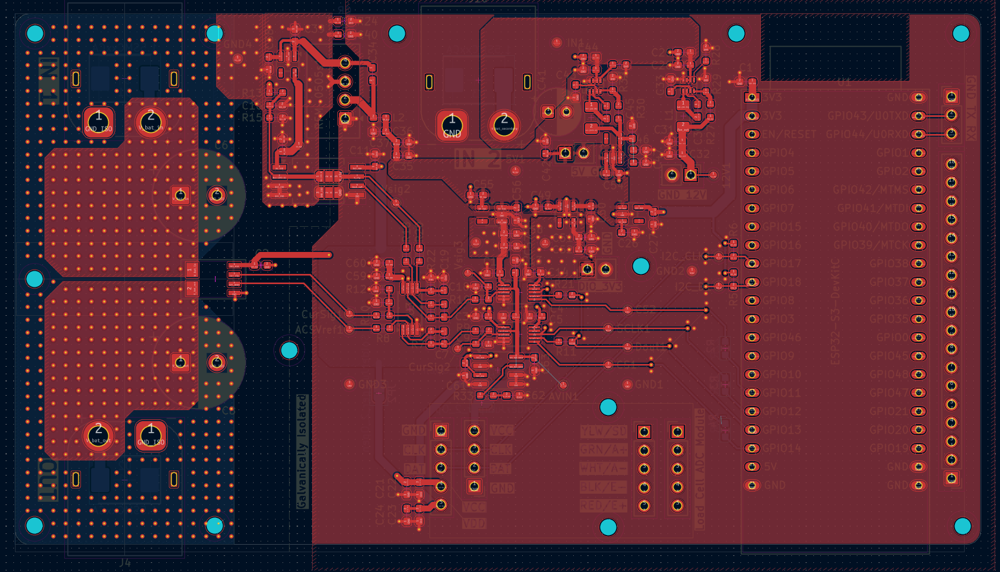
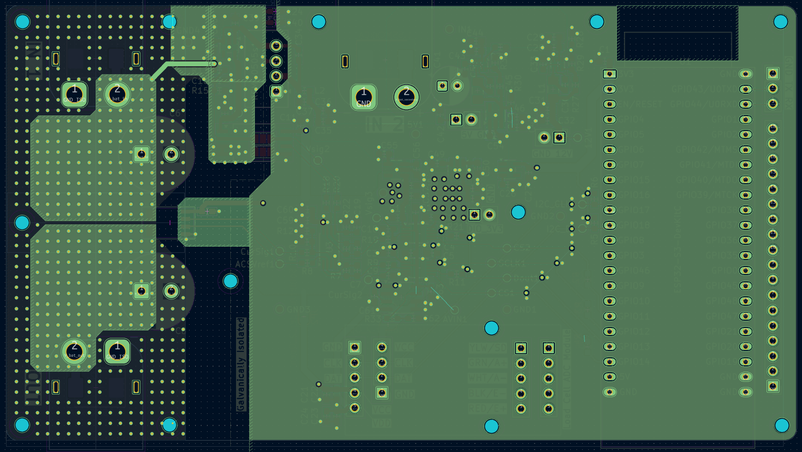
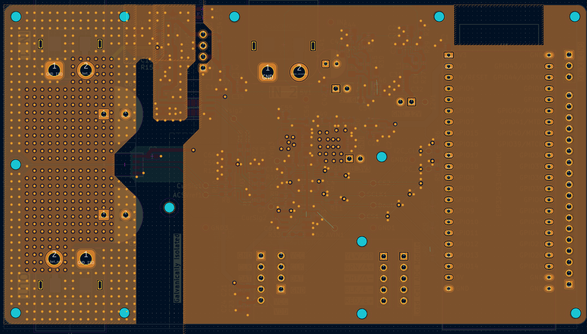
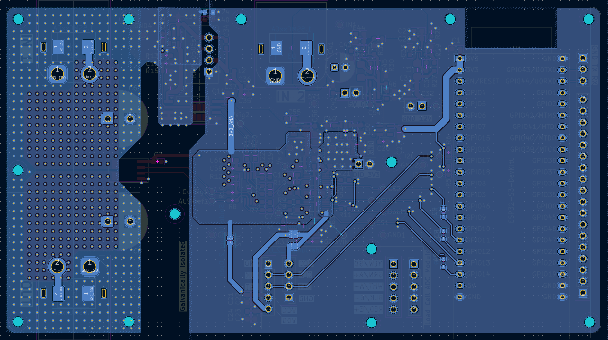

## The Drone Motor Testbench (Work in Progress)

This is a personal project that is a work in progress. The idea for this project arose from the need to optimize motor-propeller combinations for the industrial drone project.

This project serves as a base for a drone PMU (power management unit) project I am planning on doing in the future. 

### General description of the device

The aim of the project is to design and implement a test bench suitable for drone motors, capable of measuring the current, voltage and power of the drone motor, the rotational speed of the motor or blades, and the thrust generated by the motor. The idea is that different combinations of motors, propellers, and motor controllers can be tested to achieve the best efficiency.

The device measures the motor's current and voltage which can be used to calculate the power taken from the battery. The device measures the thrust generated by the motor with a load cell that is mechanically coupled to the motor. The propeller rotational speed is also measured with an optical sensor.

### Planned features

- Compatibility for various types of motors and motor controllers.
- Python based plotting / UI (and possibly a Web UI hosted on the ESP32) for graphing measurement results in real time
- Battery operable from typical drone batteries (input voltage range up to 30 V, 4-6s) 
- Automated test sequences
  
### Target specifications

Current measurements:

- Max Current: 60 A (peak), 30 A sustained for several minutes
- Accuracy:   100 mA
- Resolution: 20 mA or less.
- Bandwidth: 10 kHz.

Voltage measurements:

- Max input Voltage: 30 V
- Accuracy: 100 mV
- Resolution: 20 mV.
- Bandwidth: 10 kHz.

Thrust measurements:

- Range: 0-5 kg
- Accuracy: 100g
- Resolution: 20g

Propeller measurements:

- Rotational speed: 20 000 rpm
- Accuracy: 100 rpm

These requirements were arbitarily selected as a basis for the project but the fullfilment of these goals is not the most important aspect of this project.

## Current Progress

Most of the system has been implemented and the PCB layout is almost finished. Only minor tweaks to the PCB layout and component selectio has to be done before ordering of the PCB. The general level system block diagram can be found below.

  
  
<em> System block diagram.</em>

### General description and Main Components of the System 

- Microprocessor: The ESP32 was chosen as the microprocessor because it has Wifi capability and can stream the measurement results via a web server UI. 
- Current sensor: Allegro Microsystems ACS37030-065B3. Isolated, Ratiometric, Bi-directional.
- Voltage measurement: Resistor ladder + ACPL-C87A Isolated op-amp.
- Power Regulation: TPS62933 Buck-converter + several LDOs and a 1,8 V voltage reference circuit for ADCs

The system was designed as two separate sections: High current side and measurement side. These two have separated, isolated ground reference planes to mitigate noise travelling from the drone motors to the measurements. An isolating DCDC converter was used between the main system 5V bus and the isolated side. Several different LDOs were selected as filter stages between the system switching regulators and the sensitive measurement parts. Two separate power planes were implemented for analog and digital circuitry.

The system utilizes two separate 16-bit high sample rate (up to 1 Mhz) ADCs to measure the motor current and voltage. These measurements are fed differentially to active LPF op amps stages before the sampling ADCs. An ESP32-S3 was selected as the system microprocessor. The high speed 80 MHz SPI bus was used between the high speed ADCs and the ESP. For the thrust measurement a generic load-cell and HX711 module headers were implemented on to the board. For the RPM measurement, the ESP32 internal pulse counter and an optical sensor will be used.

  
  
<em> Current version of the board layout. </em>

#### Current Measurement

The Allegro ACS37030-065B3 was selected as the primary current sensor specifically for its VREF pin, a critical feature for leveraging the full potential of the 16-bit ADC chain. As the sensor is natively bidirectional, it produces a 1.65V offset at zero current, which would effectively waste half of the measurement range in a unidirectional drone application. By utilizing the ACS37030’s VREF signal, we can implement a differential op-amp configuration that subtracts this offset and allows for signal scaling, ensuring the motor current utilizes the ADC's entire dynamic range rather than just the upper half.

This differential configuration also provides automatic ratiometric error mitigation and superior noise immunity. Since both the measurement signal and VREF scale identically with the 3.3V supply voltage, the op-amp stage cancels out any voltage sags or ripple as common-mode noise, which would otherwise distort the readings. The result is a stable, high-resolution signal that remains reliable even when high-power transients cause fluctuations in the supply lines, ensuring the data integrity required for precise efficiency and power calculations.

[ACS Datasheet](https://www.mouser.com/catalog/specsheets/Allegro_MicroSystems_01032024_ACS37030-32-Datasheet.pdf)

The sensor is capable of measuring current up to 65 amps with a bandwidth of 5 MHz, which is sufficient for one drone motor and meets the project requirements. The sensor produces a voltage proportional to the current passing through with a sensitivity of 20.3 mV/A. At full 65 A current, the sensor produces an output voltage of approximately 1.32 V. Although the internal resistance of the measurement circuit is low (0.6 mΩ), the power loss generated at peak currents is significant (2.5 W) and requires sufficient cooling.

The ACS772LCB-100B-SMT-T might have been a better choice for the current sensor. Its internal resistance is only 100 micro-ohms, so it would have been better able to withstand continuous loading. In addition, its current measurement range is up to 100 A, so it could also have been used with larger motors.

[Datasheet](https://www.allegromicro.com/~/media/files/datasheets/acs772-datasheet.pdf)

#### ADCs and buffering

The system utilizes two 16-bit Microchip MCP33131 SAR ADCs to achieve the measurements of both current and voltage. Due to the Successive Approximation Register (SAR) architecture, MCP6022 dual op-amp was put as a buffer between the source and the ADC. The MCP6022 is configured as a differential amplifier for both measurement channels. This approach maximizes the ADC's dynamic range and provides superior common-mode noise rejection.

Current Measurement Path: The differential stage (U3A) takes the cur_sig and ACS_VREF signals from the ACS37030 sensor. It is configured with a 2.2 gain (R7/R8 = 2.2 kOhm / 1 kOhm) to scale the unidirectional current signal to match the ADC's input range. 

Voltage Measurement Path: The stage (U3B) processes the V_sig and Vout_ref signals from the ACPL-C87A isolation amplifier. It utilizes 1.5 gain (R7/R18 = 1.5) to normalize the isolated voltage signal for the ADC. 

##### Integrated Filtering and Anti-Aliasing

To ensure high signal quality in the noisy environment of a drone motor testbench, a two-stage filtering strategy was implemented for each channel:

Active Low-Pass Filter: A 1 nF capacitor (C7/C15) in the op-amp feedback loop provides initial high-frequency damping directly at the amplification stage. 

Passive Anti-Aliasing Filter: A final RC low-pass filter consisting of a 22 ohm resistor and a 100 nF capacitor (C9/C18) is placed immediately before the ADC input. This stage provides a calculated cut-off frequency of approximately 72,3 kHz. This filtering chain effectively suppresses switching noise from the ESC and DC-DC converters, preventing aliasing and ensuring that the 16-bit ADC captures a clean, representative signal of the motor's performance.

  
  
<em> Differential operational amplifiers. </em>

##### Thrust measurement

The thrust measurement stage currently utilizes an HX711 module, although its 20 SPS sampling rate is notably low compared to the high-speed sensors used in the rest of the system. To balance cost-effectiveness with design flexibility, the load cell ADC circuitry was implemented modularly rather than being integrated directly onto the main board.

This modular approach is achieved through dual-sized headers on the PCB, supporting the direct use of a standard HX711 or alternative commercial modules like the CS1238. Additionally, these headers provide the versatility to interface with a custom-designed ADC board should higher performance be required in future iterations.

  
  
<em> Modular design for the load cell ADCs. </em>

#### Power Architecture and Signal Integrity

The power architecture is implemented in multiple stages to prioritize signal integrity, high-frequency noise rejection, and overall system efficiency.

##### Primary Buck Regulation Stage

The system is powered by a dedicated electronics battery (separate from the motor supply) with an input range of 12 V to 30 V. Two TPS62933 synchronous buck converters serve as the primary regulation stage:

- 12 V Rail: Dedicated to the cooling system (case fan). A minimum input of 12 V is required to maintain this rail.
- 5 V Rail: Acts as the primary bus for all logic and analog sub-systems. 

The converter is configured for a 500 kHz switching frequency to balance efficiency and component size. 

  
  
<em> First power stage of the electronic's side. </em>

##### Post-Regulation and Noise Filtering

To ensure measurement accuracy, the 5 V rail undergoes post-regulation before reaching sensitive circuitry. A TPS7A20 LDO is placed immediately after the 5 V buck converter. This specific LDO was selected for its ultra-high PSRR (Power Supply Rejection Ratio) at high frequencies and exceptionally low output noise (12 uV RMS). While generic LDOs often lose their filtering capability above 10 kHz, the TPS7A20 maintains significant rejection at the 500 kHz switching frequency of the buck converter, effectively "cleaning" the rail before it enters the rest of the system.

##### Dedicated Supply Rails

To prevent digital switching noise from coupling into analog measurements, the system utilizes separate LDOs for different domains:

- 3.3 V Digital Supply: A cost-effective TLV7733P LDO provides power for the digital logic and matching the ESP32’s SPI logic levels.
- 3.3 V Analog Supply: A second high-performance TPS7A20 LDO powers the analog sections of the ADCs and the MCP6022 OpAmp buffers to ensure a stable, low-noise signal path.

Isolated Supply: An RFM-0505S isolated DC-DC converter, followed by an LDO and LC-filtering, provides the floating power for the "hot side" of the ACPL isolation amplifier, ensuring complete galvanic separation. 

##### High-Precision ADC Referencing

The MCP33131 ADC is highly sensitive to reference stability. To minimize measurement drift caused by the high thermal loads expected during 65 A motor tests, the 1.8 V analog supply is not handled by a standard LDO. Instead, a dedicated MCP1501-18 precision voltage reference circuit is used. This provides a temperature-stable 1.8 V source with excellent initial accuracy, ensuring that the ADC readings remain consistent even as the PCB temperature rises during prolonged high-power sequences.

  
  
<em> Second power stage of the electronic's side. </em>

### PCB Layout

The PCB was designed with 4-layers. The stackup is: PWR/sig, GND, GND, PWR/sig. I believe this was the most optimal setup for my system as I can have a clean ground reference layer for the sensitibe measurements and high speed signals. I managed to keep the two inner GND layers completely intact.

Things I have considered during layout:

- Prioritizing signal integrity for the measurements.
- Separating hot components / areas from sensitive circuitry. 
- Separated switching devices from sensitive analog circuitry.
- Separated and partly split ground planes block high amplitude and high frequency / noisy motor current from the measurement side.
- Current return paths. Tried to minimize crossing return paths for digital and analog circuitry.
- High current specialities: 
  - Plane / trance current dimensioning: Calculated and estimated the required trace thickness and width for the application.
  - Thermal design. Located hot high current planes on its own side of the PCB with separated ground planes to mitigate conductive heat transfer to the measurement electrronics. Impelemented high current path with exposed copper layers and two 1 oz planes tied together for + and - routes to allow adding a layer of solder to the high current path. This is mainly to improve thermal capabilities as tin has roughly 5-10x worse electrical conducitivity than the copper on the power plane.
  - Tried to minimize the loop inductance for the high current. This was a bit difficult due to bulky connectors and requirement of using multiple layers and many vias for the current route.
- Mechanical design: This PCB will be used in a functional device which required that the usability and mechanical design was also taken into account during PCB design.

  
  
<em> Top layer. </em>

  
  
<em> Mid layer 1. </em>

  
  
<em> Mid layer 2. </em>

  
  
<em> Bottom layer. </em>

